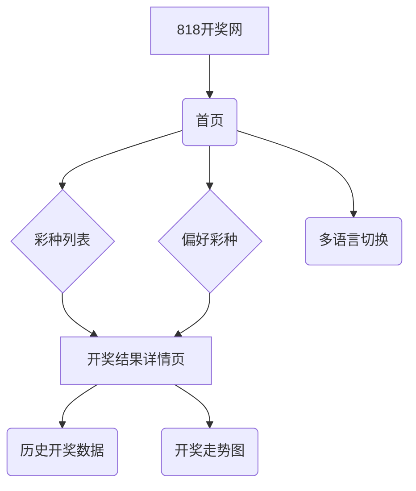

# 产品需求文档 (PRD) - 818开奖网

---

## 1. 文档信息

| 版本 | 日期       | 作者 | 变更内容 |
| :--- | :--------- | :--- | :------- |
| 1.0  | 2023-10-27 | AI PM | 初始草案 |

**文档目的**：本文档旨在明确“818开奖网”的产品愿景、功能需求、用户群体和技术规范，为设计、开发、测试和运营团队提供统一的指导方针。

**相关文档**：
- `docs/Roadmap.md` (待创建)
- `docs/User_Story_Map.md` (待创建)
- `docs/Metrics_Framework.md` (待创建)

---

## 2. 产品概览

- **产品名称**：818开奖网
- **产品定位**：一个简洁、快速、多语言的彩票开奖结果查询网站和应用。
- **愿景与使命**：成为全球彩民首选的、最即时的开奖结果信息源，打破语言和地域的障碍。
- **价值主张**：为用户提供一个无需注册、无广告干扰、即点即查的纯粹开奖结果查询体验。
- **解决的用户痛点**：
  - 官方网站信息繁杂，查询效率低。
  - 现有应用广告多，用户体验差。
  - 缺乏一个聚合多地区、多类型彩票信息的统一平台。
  - 跨境彩民在查询海外彩票信息时存在语言障碍。
- **目标平台列表**：
  - **Web** (H5)
  - **微信小程序**
  - **iOS App**
  - **Android App**

---

## 3. 用户研究

- **目标用户画像**：
  - **核心用户**：频繁购买彩票的彩民，年龄在25-55岁之间，对开奖结果的即时性要求高，希望快速核对自己是否中奖。
  - **次要用户**：偶尔购买彩票或对彩票数据感兴趣的人群，如图表分析爱好者、研究人员等。
- **用户场景分析**：
  - **场景一（高频）**：小张是一位忠实的“双色球”彩民，每期开奖日晚上，他都希望能第一时间在手机上看到开奖号码，核对自己的彩票。
  - **场景二（跨境）**：居住在海外的李先生，喜欢购买当地的“Powerball”，他希望有一个中文界面的应用能让他方便地查询开奖结果。
  - **场景三（数据分析）**：数据分析师王女士正在研究彩票号码的走势，她需要一个能清晰展示历史开奖数据的平台。

---

## 4. 市场与竞品分析

- **市场趋势**：移动互联网的普及使得彩民越来越倾向于通过手机查询信息。简洁、无干扰的工具型应用更受用户青睐。
- **竞品分析**：
  - **直接竞品**：`www.228168d.com` 等各类彩票开奖网站。
    - **优势**：彩种覆盖全面，数据更新快。
    - **劣势**：界面设计陈旧，广告多，缺少多语言支持，用户体验有待提升。
  - **我们的差异化策略**：
    1. **极致的用户体验**：无注册登录，无干扰广告，专注核心功能。
    2. **国际化**：提供多语言支持（初期支持中文、英文），服务全球用户。
    3. **跨平台覆盖**：基于uniapp开发，一次编码，多端发布，覆盖Web、小程序和App。

---

## 5. 产品功能需求

- **功能架构图**：

- **核心功能详述**：

  - **功能1：首页-开奖大厅**
    - **用户故事**：作为一个用户，我希望一打开应用就能看到我关心的几个主要彩种的最新开奖结果，以便快速获取信息。
    - **功能逻辑**：
      - 默认展示热门或用户偏好的彩种列表。
      - 每个彩种以卡片形式展示，包含：彩种名称、最新期号、开奖号码、开奖时间。
      - 页面需有下拉刷新功能，以获取最新数据。
    - **验收标准**：
      - 首页加载时间不超过2秒。
      - 开奖数据与官方源延迟不超过1分钟。
      - 列表滚动流畅不卡顿。

  - **功能2：多语言支持**
    - **用户故事**：As an English speaker, I want to be able to switch the app's language to English so that I can understand everything easily.
    - **功能逻辑**：
      - 在设置或首页右上角提供语言切换入口。
      - 初期支持简体中文和英文。
      - 切换语言后，所有界面文字、彩种名称等都需要相应变化。
    - **验收标准**：
      - 语言切换功能在所有页面均可访问。
      - 95%以上的界面元素都已完成翻译。

  - **功能3：彩种选择与偏好设置**
    - **用户故事**：作为一个用户，我希望能从众多彩种中选择我常看的几个，并将它们固定在首页顶部，方便我每次查看。
    - **功能逻辑**：
      - 提供一个完整的彩种列表页，按地区（如全国彩、境外彩）或类型（如极速彩）分类。<mcreference link="https://www.228168d.com/" index="0">0</mcreference>
      - 用户可以点击彩种旁边的星号或按钮，将其添加/移除“我的偏好”。<mcreference link="https://www.228168d.com/" index="0">0</mcreference>
      - 偏好彩种数量上限为5个。<mcreference link="https://www.228168d.com/" index="0">0</mcreference>
    - **验收标准**：
      - 偏好设置能被本地保存，下次打开应用时依然生效。
      - 添加/移除操作响应迅速。

  - **功能4：开奖结果详情与历史数据**
    - **用户故事**：作为一个用户，当我点击某个彩种后，我希望能看到它详细的开奖信息，并能查看过去的历史开奖记录，以供分析。
    - **功能逻辑**：
      - 展示指定彩种当期的详细开奖信息。
      - 提供历史开奖列表，支持按日期或期号查询。
      - （可选，V2功能）提供简单的号码走势图表。
    - **验收标准**：
      - 历史数据至少可回溯最近100期。
      - 历史数据查询响应迅速。

---

## 6. 非功能需求

- **性能**：应用启动时间 < 3秒，页面切换流畅，API响应时间 < 500ms。
- **安全性**：API接口需要进行基本的防刷、防爬虫处理。
- **可用性**：确保在主流的手机型号和浏览器上都能正常显示和使用。
- **数据统计**：需要集成第三方统计工具（如友盟、Google Analytics），以追踪用户行为和KPI。

---

## 7. 技术架构考量

- **前端**：**uniapp**框架，使用Vue.js语法进行开发。
- **后端**：建议使用成熟的后端语言（如Node.js, Go, or Python）构建RESTful API。
- **数据源**：需要寻找稳定、可靠的彩票开奖数据API供应商，或自建爬虫抓取（需注意法律风险和维护成本）。
- **部署**：Web端部署在云服务器或静态网站托管服务上（如Vercel, Netlify）。

---

## 8. 产品成功指标 (KPI)

- **北极星指标**：**日活跃用户数 (DAU)** - 衡量产品的核心用户规模和粘性。
- **核心KPI**：
  - **用户留存率**（次日、7日、30日）：衡量产品对用户的吸引力。
  - **平均会话时长**：反映用户在产品内的参与度。
  - **彩种详情页查看率**：衡量核心功能的渗透率。