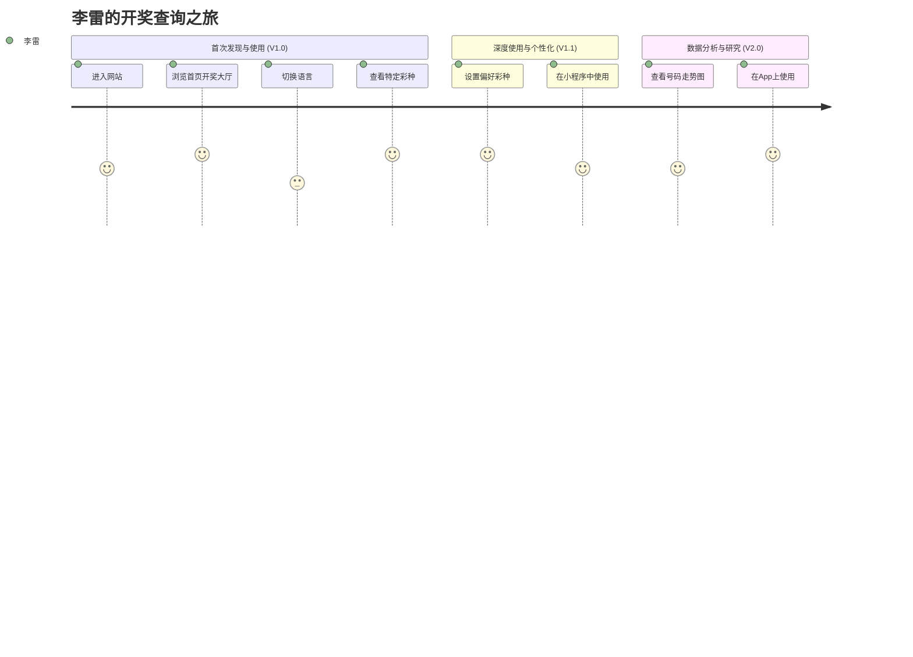

# 用户故事地图 (User Story Map) - 818开奖网

---

## 1. 核心用户画像

- **角色**：李雷 (Li Lei)
- **背景**：35岁，一名普通的上班族，有定期购买彩票的习惯，关心国内外多种彩票。
- **目标**：快速、方便地查询开奖结果，不受广告和复杂操作的干扰。

---

## 2. 用户旅程与故事地图

**横轴 (Activities)** 代表用户在产品中的主要活动流程。
**纵轴 (Tasks/Stories)** 代表支撑这些活动的具体任务和用户故事，并按优先级（上到下）和发布版本（左到右）进行排列。

---

## 3. 故事详述与版本规划

### **用户活动 (Activity): 1. 查找与访问**

| 用户任务 (Task)          | 用户故事 (User Story)                                           | 版本  |
| :----------------------- | :-------------------------------------------------------------- | :---- |
| **通过搜索引擎找到网站** | 作为一位新用户，我希望能通过搜索“彩票开奖”等关键词，轻松找到818开奖网。 | V1.0  |
| **直接访问H5页面**     | 作为一个用户，我希望能直接在手机或电脑浏览器中输入网址，快速访问。 | V1.0  |
| **从微信中打开小程序**   | 作为微信用户，我希望可以直接在微信里搜索并打开小程序进行查询。 | V1.1  |
| **从应用商店下载App**    | 作为一个重度用户，我希望能在App Store或Google Play下载原生应用。 | V2.0  |

### **用户活动 (Activity): 2. 浏览与查询**

| 用户任务 (Task)            | 用户故事 (User Story)                                                               | 版本  |
| :------------------------- | :---------------------------------------------------------------------------------- | :---- |
| **浏览首页开奖信息**       | 作为一个用户，我希望一进入首页就能看到多个热门彩种的最新开奖号码和时间。                | V1.0  |
| **刷新获取最新结果**       | 作为一个心急的彩民，我希望可以通过下拉刷新的方式，立即获取到刚刚出炉的开奖结果。      | V1.0  |
| **查看特定彩种详情**       | 当我对某个彩种感兴趣时，我希望能点击它，进入一个专门的页面查看更详细的信息。            | V1.0  |
| **查看历史开奖记录**       | 作为一个研究者，我希望能方便地翻阅某个彩种过去的多期开奖记录，以寻找规律。            | V1.0  |

### **用户活动 (Activity): 3. 个性化设置**

| 用户任务 (Task)        | 用户故事 (User Story)                                                                   | 版本  |
| :--------------------- | :-------------------------------------------------------------------------------------- | :---- |
| **切换界面语言**       | As an international user, I want to switch the language to English to use the app without barriers. | V1.0  |
| **添加/删除偏好彩种**  | 我常买的彩票就那几种，我希望能把它们收藏起来，这样每次打开就不用去列表里找了。<mcreference link="https://www.228168d.com/" index="0">0</mcreference>   | V1.1  |
| **在首页查看偏好彩种** | 我希望我收藏的彩种能固定显示在首页的最上方，方便我第一时间看到。                        | V1.1  |

### **用户活动 (Activity): 4. 数据分析**

| 用户任务 (Task)    | 用户故事 (User Story)                                                   | 版本  |
| :----------------- | :---------------------------------------------------------------------- | :---- |
| **查看号码走势图** | 我想看到号码在过去几十期内的分布情况，希望能有一个直观的图表来帮助我分析。 | V2.0  |
| **分析冷热号码**   | 作为一个技术型彩民，我希望能看到哪些号码是近期热门，哪些是冷门。         | V2.0  |
| **筛选历史数据**   | 为了做更深入的研究，我希望能按日期范围筛选历史开奖数据。                 | V2.0  |

---

## 4. 关键用户体验触点

- **首次加载速度**：必须快，这是给用户的第一印象。
- **数据即时性**：开奖结果的更新速度是产品的核心竞争力。
- **无干扰体验**：干净的界面，无弹窗、无广告。
- **语言切换的便捷性**：让国际用户感到友好和被尊重。
- **偏好设置的流畅性**：简单的交互，即时的反馈。